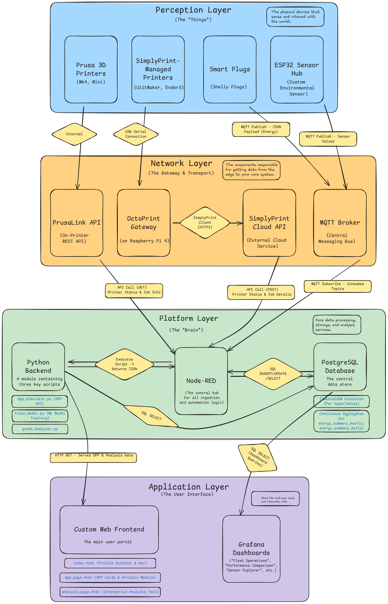

# **ENMS Project** – IoT-based Energy & Device Monitoring System

## 📌 Overview

The **ENMS Project** is an **IoT-based, real-time monitoring and analytics platform** designed for factories, production facilities, and IoT environments.
It integrates **Node-RED**, **PostgreSQL**, **Grafana**, a dedicated **Python ML Service**, and **Nginx** into a **zero-touch Dockerized deployment**.

Main features:

* Real-time IoT data ingestion via MQTT.
* A stable, high-performance Machine Learning pipeline for live predictions.
* PostgreSQL (TimescaleDB) storage for time-series analysis.
* Grafana dashboards for rich visualization.
* Node-RED for low-code automation and data processing flows.
* Fully containerized with Docker Compose for easy and portable deployment.

---

## System Architecture

The system is a collection of microservices managed by Docker Compose. The new architecture ensures stability and scalability, especially for the machine learning components.



---

## 🚀 Getting Started

Follow these steps to get the entire ENMS stack running on your local machine.

### Prerequisites

*   **Docker** (version 20.10.x or later)
*   **Docker Compose** (version v2.x or later)
*   **Git**

### 1. Clone the Repository

First, clone the project to your local machine:
```bash
git clone https://gitlab.com/raptorblingx/enms-project.git
cd enms-project
```

### 2. Configure Your Environment

The project uses a `.env` file to manage all secrets and essential configuration, such as database passwords and MQTT credentials. A template is provided for you.

**Crucial Step:** You must copy the example file to create your own local configuration:
```bash
cp .env.example .env
```

Next, open the `.env` file in a text editor and **change the default passwords** to secure values of your choice.

**Example `.env` file:**
```env
# PostgreSQL Database Settings
POSTGRES_USER=enms_user
POSTGRES_PASSWORD=change_this_to_a_secure_password
POSTGRES_DB=enms_db

# Node-RED Credentials
NODE_RED_CREDENTIAL_SECRET=change_this_to_a_long_random_secret

# Mosquitto MQTT Broker Credentials
# These will be used by the mosquitto_config_generator on first run
MQTT_USER=mqtt_user
MQTT_PASSWORD=change_this_to_a_secure_mqtt_password
```

### 3. Launch the Stack

With your configuration in place, you can build and launch the entire stack with a single command:
```bash
docker compose up --build -d
```
*   `--build`: Builds the custom Docker images (for Node-RED and the ML worker) before starting.
*   `-d`: Runs the containers in detached mode (in the background).

The first launch may take a few minutes as Docker downloads images and builds the containers.

### 4. Access the Services

Once the containers are running, you can access the various parts of the ENMS platform:

| Service               | URL                                           | Default Credentials (from `.env`) |
| --------------------- | --------------------------------------------- | --------------------------------- |
| **Main Web UI**       | [http://localhost/](http://localhost/)        | -                                 |
| **Node-RED**          | [http://localhost:1880](http://localhost:1880) | -                                 |
| **Grafana**           | [http://localhost:3000](http://localhost:3000) | `admin` / `grafana` (first login) |
| **PostgreSQL DB**     | `localhost:5432`                              | `enms_user` / (your password)     |
| **Python API** (DPP)  | [http://localhost/api/dpp_summary](http://localhost/api/dpp_summary) | -                               |
| **MQTT Broker**       | `localhost:1883`                              | `mqtt_user` / (your password)     |

---

## 📦 Project Structure

```
enms-project/
│
├── backend/             # Backend services, including DB init, ML model, and prediction worker
├── docs/                # Supporting documentation and architecture diagrams
├── frontend/            # Frontend HTML, CSS, and JavaScript files
├── grafana/             # Grafana provisioning (datasources, dashboards)
├── nginx/               # Nginx reverse proxy configuration
├── node-red/            # Node-RED flows, settings, and custom Dockerfile
├── python-api/          # Python Flask application for the legacy DPP API
├── .env.example         # Example environment file
├── docker-compose.yml   # Main Docker Compose file for orchestrating services
├── ANALYSIS_DEEP_DIVE.md # Deep dive into the analysis engine & ML models
├── Custom Hardware.md # Details on custom sensor hardware (ESP32, etc.)
├── DPP_API_Documentation.md # Detailed developer documentation for the DPP API
├── ui_guide.md          # Guide to the user interface and user profiles
├── ENMS_Technical_Details.md # General project documentation
└── README.md            # This file
```

---

## 📄 Documentation

*   For **The DPP API Reference**, see: 📖 [`DPP_API_Documentation.md`](./DPP_API_Documentation.md)
*   For **Technical Details** (architecture, data flows, deployment), see: 📜 [`ENMS_Technical_Details.md`](./ENMS_Technical_Details.md)
*   For a **Guide to the User Interface** and different user profiles, see: 👤 [`ui_guide.md`](./ui_guide.md)
*   For a **Deep Dive into the Analysis Engine and ML Model Training**, see: 🧠 [`ANALYSIS_DEEP_DIVE.md`](./ANALYSIS_DEEP_DIVE.md)
*   For **Details on the Custom Sensor Hardware** and connectivity, see: 🔩 [`Custom Hardware.md`](./Custom%20Hardware.md)

---

## 🛡 Zero-Touch Deployment

This project supports **zero-touch deployment**:

* All flows, settings, and dashboards are preloaded.
* The MQTT broker is automatically configured on first launch.
* No manual post-deployment configuration is required.
* Ready to use immediately after `docker compose up`.
