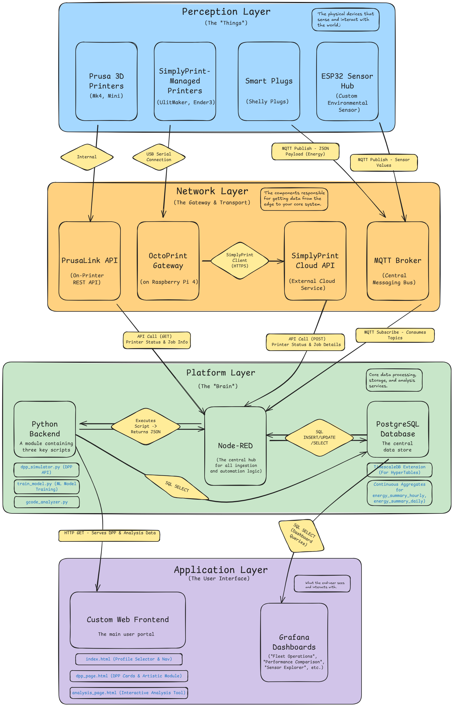

# **ENMS Project** – IoT-based Energy & Device Monitoring System

## 📌 Overview

The **ENMS Project** is an **IoT-based, real-time monitoring and analytics platform** designed for factories, production facilities, and IoT environments.
It integrates **Node-RED**, **PostgreSQL**, **Grafana**, **Python Flask API**, and **Nginx** into a **zero-touch Dockerized deployment**.

Main features:

* Real-time IoT data ingestion (MQTT, Modbus, APIs).
* PostgreSQL (TimescaleDB) storage for time-series analysis.
* Grafana dashboards for rich visualization.
* Node-RED automation flows.
* Flask API for external integrations.
* Fully containerized for easy deployment.

---

## System Architecture




---

## 🚀 Quick Start

### 1️⃣ Clone the repository

```bash
git clone https://gitlab.com/raptorblingx/enms-project.git
cd enms-project
```

### 2️⃣ Build & run the stack

```bash
docker compose up --build -d
```

### 3️⃣ Access services

| Service    | URL                                                                   |
| ---------- | --------------------------------------------------------------------- |
| Node-RED   | [http://localhost:1880](http://localhost:1880)                        |
| Grafana    | [http://localhost:3000](http://localhost:3000)                        |
| Web Server | [http://localhost/](http://localhost/)                                |
| Flask API  | [http://localhost/api/dpp\_summary](http://localhost/api/dpp_summary) |
| PostgreSQL | `localhost:5432` (user/pass in `.env`)                                |

---

## ⚙ Environment Variables (TODO)

All sensitive configs are in `.env`:

```env
POSTGRES_USER=enms_user
POSTGRES_PASSWORD=secure_password
POSTGRES_DB=enms_db
NODE_RED_CREDENTIAL_SECRET=enms-prod-secret-2025
MQTT_USER=mqtt_user
MQTT_PASSWORD=mqtt_pass
```

In addition to the `.env` file for credentials, the project uses environment variables to define paths for data, models, and Python scripts. These are set in the `docker-compose.yml` and `docker-compose.override.yml` files.

| Variable      | Description                                                                                                  | Default Value           |
|---------------|--------------------------------------------------------------------------------------------------------------|-------------------------|
| `PROJECT_PY`  | Mounts the entire Python API source code into the `python-api` container. Essential for development.           | `./python-api`          |
| `MODEL_DIR`   | Mounts the directory containing pre-trained machine learning models into the `node-red` container.             | `./backend/models`      |
| `DATA_DIR`    | Mounts the directory containing raw data (like CSV files for model training) into the `node-red` container.    | `./backend/data`        |

---

## 📦 Project Structure

```
enms-project/
│
├── backend/             # Backend services, including database initialization and ML model training
├── docs/                # Supporting documentation and architecture diagrams
├── frontend/            # Frontend HTML, CSS, and JavaScript files
├── grafana/             # Grafana provisioning (datasources, dashboards)
├── nginx/               # Nginx reverse proxy configuration
├── node-red/            # Node-RED flows, settings, and custom nodes
├── python-api/          # Python Flask application for the DPP API
├── artistic-resources/  # Image assets for the frontend
├── docker-compose.yml   # Main Docker Compose file for orchestrating services
├── ANALYSIS_DEEP_DIVE.md # Deep dive into the analysis engine & ML models
├── Custom Hardware.md # Details on custom sensor hardware (ESP32, etc.)
├── DPP_API_Documentation.md # Detailed developer documentation for the DPP API
├── ui_guide.md          # Guide to the user interface and user profiles
├── ENMS_Technical_Details.md # General project documentation
└── README.md            # This file
```

---

## 🧩 Included Services

* **Node-RED** – Data ingestion, processing, and automation
* **PostgreSQL + TimescaleDB** – Optimized time-series database
* **Grafana** – Real-time dashboards
* **Python Flask API** – Data access for external apps
* **Nginx** – Reverse proxy for API & web access
* **MQTT Broker** – External or internal message broker

---

## 📄 Documentation

*   For **The DPP API Reference**, see: 📖 [`DPP_API_Documentation.md`](./DPP_API_Documentation.md)
*   For **Technical Details** (architecture, data flows, deployment), see: 📜 [`ENMS_Technical_Details.md`](./ENMS_Technical_Details.md)
*   For a **Guide to the User Interface** and different user profiles, see: 👤 [`ui_guide.md`](./ui_guide.md)
*   For a **Deep Dive into the Analysis Engine and ML Model Training**, see: 🧠 [`ANALYSIS_DEEP_DIVE.md`](./ANALYSIS_DEEP_DIVE.md)
*   For **Details on the Custom Sensor Hardware** and connectivity, see: 🔩 [`Custom Hardware.md`](./Custom%20Hardware.md)

---

## 🛡 Zero-Touch Deployment

This project supports **zero-touch deployment**:

* All flows, settings, and dashboards are preloaded.
* No manual post-deployment configuration required.
* Ready to use immediately after `docker compose up`.
