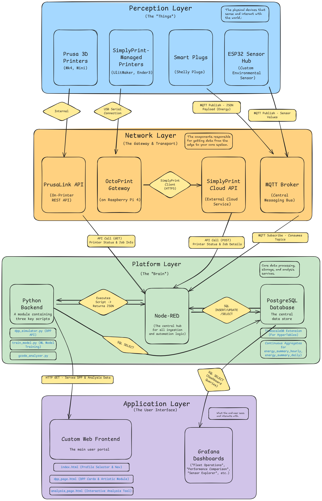

# ENMS Technical Documentation

This document provides a deep dive into the architecture, data flows, interfaces, and deployment procedures for the Energy Management System (ENMS) project.

## 1. Architecture Overview

The ENMS platform is designed as a modular, containerized system that follows a layered architecture pattern. This allows for clear separation of concerns, from physical data acquisition at the edge to data processing, storage, and user-facing applications.

### 1.1. Architecture Diagram

The following diagram illustrates the high-level system architecture, showing the four main layers: Perception, Network, Platform, and Application.



### 1.2. Module Descriptions

#### 1.2.1. Perception Layer (The "Things")

This layer consists of the physical hardware and devices that generate data.

*   **Printers/Machines:** These are the primary assets being monitored. The system is designed to handle various 3D printers (e.g., Prusa MK4, Prusa Mini, Ender-3) and can be extended to other industrial machines. They provide operational data such as temperature, job progress, and state.
*   **Smart Plugs:** Shelly smart plugs are used to monitor the electrical energy consumption of each connected machine. They provide real-time data on power (Watts), total energy (Watt-hours), voltage, and current.
*   **ESP32 Sensor Hub:** A custom environmental sensor hub based on an ESP32 microcontroller. It is equipped with sensors like the DHT22 (temperature and humidity) and MPU6050 (accelerometer/gyroscope) to capture ambient conditions and machine vibration data.

#### 1.2.2. Network Layer (The Gateway & Transport)

This layer is responsible for data transport from the edge devices to the central platform.

*   **Printer Controllers (PrusaLink / OctoPrint):** The system interfaces with printers via their respective controllers.
    *   **PrusaLink API:** For Prusa printers, the system polls the local REST API provided by the PrusaLink software running on the printer.
    *   **OctoPrint / SimplyPrint Gateway:** For other printers like the Ender-3, the system can interface with OctoPrint or a cloud gateway service like SimplyPrint. These gateways expose APIs to get printer status and job information.
*   **MQTT Broker:** A central messaging bus (like Mosquitto or a cloud-based MQTT service) is used for real-time data ingestion from IoT devices. The Shelly plugs and the ESP32 Sensor Hub publish their readings to specific MQTT topics, which are then subscribed to by the platform layer.

#### 1.2.3. Platform Layer (The "Brain")

This is the core of the system where data is processed, stored, and analyzed. All components in this layer run as Docker containers orchestrated by Docker Compose.

*   **Node-RED:** The central hub for data ingestion, automation, and logic orchestration. It subscribes to MQTT topics, polls APIs (PrusaLink, SimplyPrint), processes the raw data, standardizes it, and inserts it into the database. It also hosts the `/api/analyze` endpoint.
*   **Database (PostgreSQL with TimescaleDB):** The system's data storage backend.
    *   **PostgreSQL:** A robust, open-source relational database used for storing metadata (e.g., device configurations, print job history).
    *   **TimescaleDB Extension:** This extension transforms standard PostgreSQL tables into hypertables, which are optimized for fast ingestion and complex queries on time-series data like energy readings and sensor data.
*   **Python Backend & Analysis Module:** This consists of a set of Python scripts that provide advanced analytical capabilities.
    *   **Flask API (`/api/dpp_summary`):** A lightweight web server that provides a real-time summary of all printers for the DPP frontend. It queries the database directly to generate this data.
    *   **ML Analysis Scripts (`gcode_analyzer.py`, `train_model.py`):**
        *   `gcode_analyzer.py`: Executed by Node-RED to parse G-code files, extract metadata, and generate thumbnails.
        *   `train_model.py`: An offline script used to train the power prediction model. It uses the **XGBoost** algorithm to create a model file (`best_model.joblib`) that the `Live Predictor` flow in Node-RED then uses for making real-time predictions.

#### 1.2.4. Application Layer (The User Interface)

This layer provides the user-facing interfaces for interacting with the system's data.

*   **Grafana Dashboards:** A powerful visualization tool used to create real-time dashboards. The system includes pre-built dashboards for:
    *   Fleet Operations: An overview of the entire printer fleet.
    *   Machine Performance Comparison: Comparing key metrics across different machines.
    *   Sensor Data Explorer: A detailed view of all sensor readings.
*   **Custom Web Frontend:** A single-page application (SPA) served by Nginx that provides custom, highly interactive user experiences.
    *   **DPP Card Module:** A visually rich carousel view of "Digital Product Passport" cards for each printer, showing live status, job progress, and a 3D G-code preview.
    *   **Artistic Module:** A "gamification" feature that visualizes energy consumption as a growing plant. The artistic resources (images of plants at different stages) are served by Nginx.
    *   **Interactive Analysis Page:** A dedicated page that allows users to select a device, time range, and specific data points ("drivers") to run a detailed backend analysis, which is then visualized using charts.
*   **Nginx:** A high-performance web server that acts as a reverse proxy, routing incoming web traffic to the appropriate service (Grafana, Node-RED, or the custom frontend files). It also serves the static assets for the frontend (HTML, CSS, JS, images).

## 2. Data Flow & Dataset Descriptions

This section describes how data flows through the system, from its source to its storage, and details the structure of the key datasets (database tables).

### 2.1. Data Flow

The data flow can be summarized as follows:

1.  **Ingestion**: Node-RED acts as the primary ingestion engine.
    *   It subscribes to MQTT topics to receive real-time data from **Shelly Smart Plugs** and **ESP32 Sensor Hubs**.
    *   It periodically polls the REST APIs of **PrusaLink** and **SimplyPrint** to get printer status and job details.
2.  **Processing**: Within Node-RED, the raw data is parsed, cleaned, standardized, and enriched. For example, a `shelly_id` from an MQTT topic is translated into an internal `device_id` by querying the `devices` table.
3.  **Storage**: The processed data is inserted into the appropriate tables in the **PostgreSQL** database. Time-series data is stored in TimescaleDB **hypertables** for efficiency.
4.  **Consumption**:
    *   **Grafana** directly queries the PostgreSQL database to populate its dashboards.
    *   The **Custom Frontend** makes API calls to endpoints (`/api/dpp_summary`, `/api/analyze`) which in turn query the database (either via the Python Flask API or Node-RED) to get data for visualization.

### 2.2. Data Sources

#### 2.2.1. APIs

*   **PrusaLink API**: A local REST API on Prusa printers. Node-RED polls the `/api/printer` and `/api/job` endpoints to get detailed status, temperature, and job progress information.
*   **SimplyPrint API**: A cloud-based REST API for managing printers. Node-RED polls the `/printers/Get` and `/jobs/GetDetails` endpoints to get data for non-Prusa printers.

#### 2.2.2. MQTT Topics

*   **Shelly Smart Plugs**:
    *   `+/status/switch:0`: Publishes a JSON payload with energy data (`apower`, `aenergy`, `voltage`, etc.). The `+` is a wildcard for the unique `shelly_id`.
*   **ESP32 Sensor Hub**:
    *   `esp32/raptorblingx/dht22/temperature_c`: Ambient temperature.
    *   `esp32/raptorblingx/dht22/humidity`: Ambient humidity.
    *   `esp32/raptorblingx/mpu6050/accel/x,y,z`: Accelerometer data.
    *   `esp32/raptorblingx/mpu6050/gyro/x,y,z`: Gyroscope data.
    *   `esp32/raptorblingx/max6675/temperature_c`: Hot-end temperature from a thermocouple.

### 2.3. Dataset Descriptions (Database Schema)

The PostgreSQL database (`reg_ml`) is the central data store. The key tables are described below.

#### 2.3.1. Metadata Tables

These tables store configuration and summary information.

*   `public.devices`
    *   **Purpose:** Stores the configuration for every monitored device. This is the central registry that links a physical device to its various IDs (e.g., `shelly_id`, `simplyprint_id`) and API credentials.
    *   **Key Columns:**
        *   `device_id` (Primary Key): The unique internal identifier for the device (e.g., `PrusaMK4-1`).
        *   `friendly_name`: A human-readable name for the UI.
        *   `shelly_id`: The ID of the associated Shelly smart plug for energy monitoring.
        *   `api_ip`, `api_key`: Credentials for local APIs like PrusaLink.
        *   `simplyprint_id`, `sp_company_id`, `sp_api_key`: Credentials for the SimplyPrint cloud API.

*   `public.print_jobs`
    *   **Purpose:** Stores historical information about every print job that has been run.
    *   **Key Columns:**
        *   `job_id` (Primary Key): A unique auto-incrementing ID for the job.
        *   `device_id`: Foreign key linking to the `devices` table.
        *   `simplyprint_job_id`: The unique job ID from the SimplyPrint service.
        *   `start_time`, `end_time`: Timestamps for the job's duration.
        *   `status`: The final status of the job (e.g., `done`, `error`).
        *   `filament_used_g`: Total filament consumed.
        *   `start_energy_wh`, `session_energy_wh`: The cumulative energy reading at the start of the job and the total energy consumed during the job, respectively.
        *   `gcode_analysis_data`: A JSONB column to store metadata extracted from G-code analysis (e.g., layer height, object dimensions).

#### 2.3.2. Time-Series Hypertables

These tables are optimized by TimescaleDB for high-volume, time-stamped data.

*   `public.energy_data`
    *   **Purpose:** Stores raw energy readings from the Shelly smart plugs.
    *   **Key Columns:**
        *   `timestamp` (Primary Key, Hypertable Time Column): The time of the reading.
        *   `device_id` (Primary Key): The device that generated the reading.
        *   `power_watts`: Instantaneous power consumption.
        *   `energy_total_wh`: The cumulative energy consumption in Watt-hours reported by the plug.

*   `public.printer_status`
    *   **Purpose:** Stores periodic snapshots of the printer's status.
    *   **Key Columns:**
        *   `timestamp` (Primary Key, Hypertable Time Column): The time of the status snapshot.
        *   `device_id` (Primary Key): The device being monitored.
        *   `state_text`: The printer's state (e.g., `Printing`, `Idle`, `Heating`).
        *   `is_printing`, `is_paused`, `is_error`: Boolean flags for quick filtering.
        *   `nozzle_temp_actual`, `nozzle_temp_target`: Actual and target nozzle temperatures.
        *   `bed_temp_actual`, `bed_temp_target`: Actual and target bed temperatures.
        *   `progress_percent`, `time_left_seconds`: Job progress indicators.

*   `public.smartplug_data`
    *   **Purpose:** Stores raw data from Tasmota-flashed smart plugs, which provide more detailed electrical data than Shelly plugs.
    *   **Key Columns:**
        *   `timestamp` (Primary Key, Hypertable Time Column): The time of the reading.
        *   `device_id` (Primary Key): The device that generated the reading.
        *   `power_w`: Instantaneous power.
        *   `energy_total_kwh`: Cumulative energy.
        *   `voltage_v`, `current_a`, `power_factor`: Detailed electrical metrics.

*   `public.ml_predictions`
    *   **Purpose:** Stores the real-time power predictions generated by the `Live Predictor` flow.
    *   **Key Columns:**
        *   `timestamp` (Primary Key, Hypertable Time Column): The time the prediction was made.
        *   `device_id`: The device for which the prediction was made.
        *   `predicted_power_watts`: The predicted power consumption value.
        *   `model_version`: The version of the ML model used for the prediction.

## 3. Interfaces

This section details the primary interfaces used for communication between the different modules of the ENMS project.

### 3.1. API Endpoints

The system exposes two main HTTP API endpoints, which are reverse-proxied through Nginx.

*   **`GET /api/dpp_summary` (The "DPP-API")**
    *   **Module:** Python Flask API (`python-api/app.py` and `dpp_simulator.py`)
    *   **Purpose:** Provides a comprehensive, real-time summary of all printers, designed to be consumed by the DPP frontend or any external application. It serves as the primary "data-object" for the Digital Product Passport, making each printer's live and historical data addressable via a simple API call.
    *   **Method:** `GET`
    *   **Query Parameters:**
        *   `?scenario=<scenario_name>` (Optional): Used for development and demonstration to load mock data instead of live data. If omitted, it defaults to `live`.
    *   **Response Body:** A JSON object containing two main keys:
        *   `printers`: An array of data-objects, where each object represents a single printer and contains detailed information about its status, job progress, energy consumption, and a "smart tip" text. This is the core of the DPP data model.
        *   `globalHistory`: An array of objects representing the most recent print jobs completed across the entire fleet.
    *   **Example Usage:** The `dpp_page.html` frontend calls this endpoint on load and periodically to refresh the printer card display. An external application could call `http://<host-ip>/api/dpp_summary` to get the same raw JSON data for its own purposes.

*   **`POST /api/analyze`**
    *   **Module:** Node-RED (`Analysis API` flow)
    *   **Purpose:** Executes a detailed energy and performance analysis for a specific device over a given time range. This is the backend for the "Interactive Analysis" page.
    *   **Method:** `POST`
    *   **Request Body:** A JSON object specifying the analysis parameters.
        ```json
        {
          "deviceId": "PrusaMK4-1",
          "timeRange": "24h",
          "selectedDrivers": {
            "nozzle_temp_actual": true,
            "bed_temp_actual": true
          }
        }
        ```
    *   **Response Body:** A detailed JSON object containing the results of the analysis, including:
        *   `summary`: A text summary of the analysis.
        *   `new_metrics`: Key metrics like total kWh and average power.
        *   `phase_analysis`: A breakdown of energy and time spent in different phases (Printing, Idle, etc.).
        *   `correlation`, `regression`: Statistical analysis results for the selected drivers.
        *   `ml_feature_importance`: The feature importances from the ML model.
        *   `grafanaUrls`: Dynamically generated URLs to view the raw data in a Grafana panel.

### 3.2. MQTT Topics

The system uses an MQTT broker for real-time data ingestion from IoT devices.

*   **Shelly Smart Plugs**
    *   **Topic:** `+/status/switch:0` (e.g., `SPPS-02/status/switch:0`)
    *   **Payload:** A JSON object containing detailed electrical data. The most important fields are `apower` (instantaneous power in Watts) and `aenergy.total` (cumulative energy in Watt-hours).
    *   **Flow:** The `Ingest Shelly MQTT` flow in Node-RED subscribes to this wildcard topic.

*   **ESP32 Sensor Hub**
    *   **Topic Namespace:** `esp32/raptorblingx/...`
    *   **Topics & Payloads:**
        *   `.../dht22/temperature_c`: Ambient temperature (e.g., `23.5`).
        *   `.../dht22/humidity`: Ambient humidity percentage (e.g., `45.2`).
        *   `.../mpu6050/accel/x,y,z`: Accelerometer readings.
        *   `.../mpu6050/gyro/x,y,z`: Gyroscope readings.
        *   `.../max6675/temperature_c`: High-precision thermocouple reading for the hot-end.
    *   **Flow:** The `ESP Sensors` flow in Node-RED subscribes to these topics.

### 3.3. SQL Queries

The platform relies on complex SQL queries to retrieve and aggregate data for analysis and visualization. Here are a few examples.

*   **Query for DPP Summary (from `dpp_simulator.py`)**
    *   **Purpose:** Gathers all necessary data for a single printer for the DPP card view. This includes current status, job progress, 24-hour energy consumption, and the energy consumption of the last completed print job.
    *   **Key Features:** Uses `LEFT JOIN LATERAL` to efficiently find the most recent status and energy readings for each device. It also performs a subquery to calculate the `kwh_last_24h`.
    *   **Example Snippet:**
        ```sql
        SELECT
            d.device_id, d.friendly_name, d.device_model,
            ps.state_text, ps.is_printing, ps.progress_percent,
            COALESCE((
                SELECT (MAX(energy_total_wh) - MIN(energy_total_wh)) / 1000.0
                FROM energy_data
                WHERE device_id = d.device_id AND timestamp >= NOW() - INTERVAL '24 hours'
            ), 0) AS kwh_last_24h,
            lj.session_energy_wh AS last_completed_job_kwh
        FROM devices d
        LEFT JOIN LATERAL (
            SELECT * FROM printer_status
            WHERE device_id = d.device_id ORDER BY timestamp DESC LIMIT 1
        ) ps ON true
        LEFT JOIN LATERAL (
            SELECT session_energy_wh FROM print_jobs
            WHERE device_id = d.device_id AND status = 'done'
            ORDER BY start_time DESC NULLS LAST LIMIT 1
        ) lj ON true
        WHERE d.device_id = 'PrusaMK4-1';
        ```

*   **Query for Analysis Page (from Node-RED `Analysis API` flow)**
    *   **Purpose:** Creates a rich, unified time-series dataset for a specific device and time range, joining energy data with the closest available printer status and environmental readings.
    *   **Key Features:** Uses `LEFT JOIN LATERAL` with a time window (`+/- 15 minutes`) to find the nearest environmental reading for each energy data point, providing a comprehensive dataset for the Python analysis script.
    *   **Example Snippet:**
        ```sql
        SELECT
            ep.timestamp, ep.power_watts,
            ps.nozzle_temp_actual, ps.is_printing,
            env.temperature_c AS ambient_temp_c
        FROM energy_data ep
        LEFT JOIN LATERAL (
            SELECT nozzle_temp_actual, is_printing FROM printer_status
            WHERE device_id = ep.device_id AND timestamp <= ep.timestamp
            ORDER BY timestamp DESC LIMIT 1
        ) ps ON true
        LEFT JOIN LATERAL (
            SELECT temperature_c FROM environment_data
            WHERE timestamp BETWEEN ep.timestamp - INTERVAL '15 minutes' AND ep.timestamp + INTERVAL '15 minutes'
            ORDER BY ABS(EXTRACT(EPOCH FROM (ep.timestamp - timestamp))) ASC
            LIMIT 1
        ) env ON true
        WHERE ep.device_id = $1 AND ep.timestamp >= $2
        ORDER BY ep.timestamp ASC;
        ```

## 4. Main Functions within Each Module

This section provides a more detailed breakdown of the responsibilities and key functions within each major software module.

### 4.1. Node-RED

Node-RED is the central nervous system of the platform, responsible for data flow orchestration, API hosting, and scheduling. Its functions are organized into a series of flows (tabs).

*   **Master Ingestion Flow:**
    *   **Function:** Acts as the main entry point for polling data from printer APIs.
    *   **Process:**
        1.  Triggers every 30 seconds.
        2.  Fetches the list of all configured devices from the `devices` table.
        3.  For each device, it routes the flow based on the data source (PrusaLink vs. SimplyPrint).
        4.  Triggers the appropriate API calls.
        5.  Detects job start/end transitions by comparing the current state with the previous state (stored in flow memory).
        6.  Triggers other sub-flows (like energy calculation and G-code analysis) based on these state changes.

*   **Ingest Shelly MQTT / ESP Sensors Flows:**
    *   **Function:** Ingest real-time data from IoT devices.
    *   **Process:**
        1.  Subscribe to specific MQTT topics.
        2.  Parse the incoming JSON or text payloads.
        3.  Standardize the data into a consistent format.
        4.  Look up the internal `device_id` from the `devices` table based on the MQTT topic or `shelly_id`.
        5.  Insert the standardized data into the appropriate time-series table (`energy_data`, `environment_data`, etc.).

*   **Job Energy & Final Energy Sub-flows:**
    *   **Function:** Accurately calculate the energy consumed by a single print job.
    *   **Process:**
        1.  **Start:** When a job start is detected, the `Job Energy Subflow` is triggered. It records the current cumulative `energy_total_wh` from the `energy_data` table and saves it as `start_energy_wh` in the `print_jobs` table.
        2.  **End:** When a job end is detected, the `Final Energy Subflow` is triggered. It runs a single atomic SQL query that fetches the latest `energy_total_wh`, subtracts the stored `start_energy_wh`, and saves the result in the `session_energy_wh` column.

*   **Analysis API Flow:**
    *   **Function:** Hosts the `POST /api/analyze` endpoint.
    *   **Process:**
        1.  Receives the analysis request from the frontend.
        2.  Constructs a complex SQL query to fetch a unified dataset, joining `energy_data`, `printer_status`, and `environment_data`.
        3.  Executes a Python script (`perform_analysis` function within the node) to perform statistical and ML analysis on the dataset.
        4.  Formats the results from the Python script into a clean JSON response.
        5.  Sends the JSON response back to the frontend.

*   **Live Predictor Flow:**
    *   **Function:** Generates real-time power predictions for active printers.
    *   **Process:**
        1.  Triggers every 10 seconds.
        2.  Fetches the latest status for all active Prusa printers.
        3.  For each printer, it prepares the feature set required by the ML model.
        4.  Executes a Python function that loads a pre-trained model and predicts the power consumption based on the live features.
        5.  Inserts the prediction into the `ml_predictions` table.

### 4.2. Python Backend

The Python code provides specialized data processing and API functionalities.

*   **`dpp_simulator.py` (Live Mode):**
    *   **Function:** Provides the data for the `GET /api/dpp_summary` endpoint.
    *   **Process:**
        1.  Connects to the PostgreSQL database.
        2.  Executes a single, comprehensive SQL query to fetch the current state, job progress, 24-hour energy usage, and historical job data for all printers.
        3.  Processes the raw database results into a structured JSON format.
        4.  Runs the `evaluate_tips` function, a "smart tips" engine that applies a set of rules to each printer's data to generate a helpful, context-aware tip (e.g., "Printer is idle but has high energy consumption").
        5.  Returns the final JSON payload to the Flask API.

*   **`gcode_analyzer.py`:**
    *   **Function:** Extracts metadata and generates a thumbnail from a G-code file.
    *   **Process:**
        1.  Triggered by a Node-RED flow (e.g., `Historical Enrichment`).
        2.  Receives the path to a G-code file as an argument.
        3.  Parses the G-code to find slicer-generated comments containing metadata (layer height, filament used, etc.).
        4.  Uses a library to render a 2D thumbnail image of the G-code and saves it to a publicly accessible directory.
        5.  Returns a JSON object containing the extracted metadata and the URL of the saved thumbnail.

### 4.3. Custom Frontend

The frontend is a Single-Page Application (SPA) that provides a rich, interactive user experience.

*   **`index.html`:**
    *   **Function:** The main entry point and application shell.
    *   **Logic:**
        1.  Presents a profile selection screen (Technical, Staff, DPP) on first visit.
        2.  Based on the selected profile, it dynamically shows/hides the relevant navigation buttons in the top bar.
        3.  Uses an `<iframe>` to load content (Grafana dashboards, Node-RED, or other HTML pages) without reloading the entire page.
        4.  Manages the theme (light/dark mode).

*   **`dpp_page.html`:**
    *   **Function:** The Digital Product Passport (DPP) card view.
    *   **Logic:**
        1.  Fetches data from the `/api/dpp_summary` endpoint.
        2.  Uses Swiper.js to render each printer as an interactive card in a carousel.
        3.  Each card displays live status, job progress, and energy data.
        4.  Implements a card-flip animation to show detailed analysis on the back.
        5.  Uses Three.js to render a 3D preview of the G-code for printing jobs.

*   **`analysis/analysis_page.html`:**
    *   **Function:** The interactive energy analysis page.
    *   **Logic:**
        1.  Provides UI controls (dropdowns, checkboxes, buttons) for the user to define an analysis.
        2.  On "Run Analysis", it sends a POST request with the user's selections to the `/api/analyze` endpoint.
        3.  Receives the JSON response from the analysis.
        4.  Uses Chart.js to render various visualizations of the results (pie charts, bar charts).
        5.  Dynamically populates HTML elements to display key metrics, insights, and suggestions.

## 5. Deployment Guide

This guide provides the necessary steps to deploy and run the ENMS project.

### 5.1. Hardware Specifications

*   **Minimum:**
    *   **CPU:** 2 Cores
    *   **RAM:** 4 GB
    *   **Storage:** 20 GB SSD
    *   **Notes:** Suitable for a small number of devices (1-5) with moderate data ingestion rates. Performance may be limited during intensive analysis.

*   **Recommended:**
    *   **CPU:** 4+ Cores
    *   **RAM:** 8+ GB
    *   **Storage:** 50+ GB SSD
    *   **Notes:** Recommended for production environments with a larger fleet of devices, ensuring smooth operation of all services, including Grafana and ML model training/inference.

### 5.2. Software Prerequisites

The host machine must have the following software installed:

*   **Docker:** The containerization platform. (Tested with version 20.10.x or later)
*   **Docker Compose:** The tool for defining and running multi-container Docker applications. (Tested with version v2.x)
*   **Git:** For cloning the project repository.

### 5.3. Installation and Setup

1.  **Clone the Repository:**
    Open a terminal on the host machine and clone the project repository.
    ```bash
    git clone https://gitlab.com/raptorblingx/enms-project.git
    cd enms-project
    ```

2.  **Environment Configuration (Optional):**
    The default configuration is set in the `docker-compose.yml` file. For production deployments, it is recommended to create a `.env` file in the project root to override default credentials. **TODO:** The `.env` file is not yet created in the repository.
    ```env
    # .env
    POSTGRES_DB=enms_db
    POSTGRES_USER=enms_user
    POSTGRES_PASSWORD=your_secure_password
    NODE_RED_CREDENTIAL_SECRET=your_long_random_secret
    ```

### 5.4. Zero-Touch Startup

The project is designed for zero-touch deployment. All services, dashboards, and flows are pre-configured to work out of the box.

1.  **Build and Run the Stack:**
    From the root of the project directory, run the following command:
    ```bash
    docker compose up --build -d
    ```
    *   `--build`: This flag tells Docker Compose to build the images from the source (e.g., for Node-RED and the Python API) before starting the containers.
    *   `-d`: This flag runs the containers in detached mode (in the background).

2.  **Verify Services:**
    After a few minutes, all services should be running. You can check the status of the containers with:
    ```bash
    docker compose ps
    ```
    You should see all services (`enms_postgres`, `enms_nodered`, `enms_grafana`, etc.) with a status of `running` or `healthy`.

3.  **Access Services:**
    The services are now available at the following default URLs:
    *   **Web Frontend:** `http://<host-ip>/`
    *   **Grafana:** `http://<host-ip>:3000/`
    *   **Node-RED:** `http://<host-ip>:1880/`

### 5.5. Retention Policy & Storage Strategy

The system uses TimescaleDB to efficiently manage large volumes of time-series data.

*   **Hypertables:** The `energy_data`, `printer_status`, `environment_data`, and `ml_predictions` tables are converted into TimescaleDB hypertables. This automatically partitions the data by time, which significantly improves insert performance and query speed.

*   **Data Retention Policy (Client Requirement):**
    *   **Requirement:** Raw data should be deleted after 6 months to manage storage usage.
    *   **Implementation:** TimescaleDB provides a built-in function for setting up automated retention policies. This needs to be configured directly in the database.
    *   **Example SQL Command to Implement Policy:**
        To be run once after the database is initialized (e.g., by connecting to the database via `psql` or as a post-init script):
        ```sql
        -- Set a retention policy to drop chunks older than 6 months for the energy_data table
        SELECT add_retention_policy('energy_data', INTERVAL '6 months');

        -- Repeat for other hypertables
        SELECT add_retention_policy('printer_status', INTERVAL '6 months');
        SELECT add_retention_policy('environment_data', INTERVAL '6 months');
        SELECT add_retention_policy('ml_predictions', INTERVAL '6 months');
        ```

*   **Continuous Aggregates (Future Enhancement):**
    *   For long-term trend analysis beyond 6 months, TimescaleDB's **continuous aggregates** can be used. These allow you to downsample raw data into aggregated views (e.g., hourly or daily averages) which are stored indefinitely with a much smaller storage footprint. This provides a path for long-term historical analysis without keeping the high-resolution raw data.

## 6. Special Modules

This section provides a detailed look at specific, advanced modules within the ENMS project.

### 6.1. Interactive Analysis Module (`/api/analyze`)

The interactive analysis module is one of the most powerful features of the platform. It allows users to perform a deep-dive analysis of a specific printer's performance, correlating its energy consumption with various operational and environmental factors. This entire process is orchestrated by the `Analysis API` flow in Node-RED.

The data flow for a single analysis request is as follows:

1.  **User Interaction (Frontend):**
    *   On the `analysis_page.html`, the user selects a device (e.g., "PrusaMK4-1"), a time range (e.g., "24h"), and a set of "drivers" to analyze (e.g., "Nozzle Temp", "Is Printing").
    *   When the user clicks the "Run Energy Analysis" button, the frontend sends a `POST` request to the `/api/analyze` endpoint. The body of this request is a JSON object containing the user's selections.

2.  **Request Handling (Node-RED):**
    *   The `http in` node in the `Analysis API` flow receives the `POST` request.
    *   A `function` node parses and validates the incoming JSON payload. It translates the user-friendly time range ("24h") into a precise ISO 8601 timestamp for the database query.

3.  **Data Aggregation (Node-RED & PostgreSQL):**
    *   A subsequent `function` node prepares the parameters for the main database query.
    *   The `postgresql` node executes a complex SQL query. This query is the heart of the data gathering process:
        *   It selects all `energy_data` points for the chosen device and time range.
        *   For each energy data point, it uses `LEFT JOIN LATERAL` to find the *most recent* `printer_status` record at or before that exact timestamp.
        *   It performs another `LEFT JOIN LATERAL` to find the *closest* `environment_data` reading within a 15-minute window of the energy timestamp.
        *   The result is a single, rich, high-resolution dataset where every energy reading is enriched with the state of the printer and the ambient environment at that precise moment.

4.  **ML & Statistical Analysis (Node-RED & Python):**
    *   The entire dataset is passed to a `python-function` node. This node executes a Python script that performs the core analysis:
        *   **Preprocessing:** The script cleans the data, handles missing values, and prepares the feature set required by the machine learning model.
        *   **ML Prediction:** It loads a pre-trained XGBoost or RandomForest model (depending on the device type) and its corresponding scaler. It then runs the model over the entire dataset to generate a "predicted power" value for every "actual power" value.
        *   **Metrics Calculation:** It calculates key performance indicators, such as total kWh consumed, average power (overall and active), and performs a detailed **phase analysis** to determine how much time and energy was spent in different states (Idle, Printing, etc.).
        *   **Statistical Analysis:** If the user selected drivers, the script calculates the Pearson correlation and performs a simple multiple linear regression to show the statistical relationship between the selected factors and power consumption.
        *   **Feature Importance:** It extracts the feature importances from the trained model to identify which factors had the most significant influence on its predictions.

5.  **Response Formatting (Node-RED):**
    *   The Python script returns a large JSON object containing all the analysis results back to the Node-RED flow.
    *   A final `function` node formats this data into the clean, structured JSON object that the frontend expects. This includes generating dynamic URLs for the Grafana panels.

6.  **Visualization (Frontend):**
    *   The `analysis_page.html` receives the final JSON response.
    *   Its JavaScript code parses the response and uses the Chart.js library to dynamically render the various charts and populate the tables and summary boxes with the analysis results.
