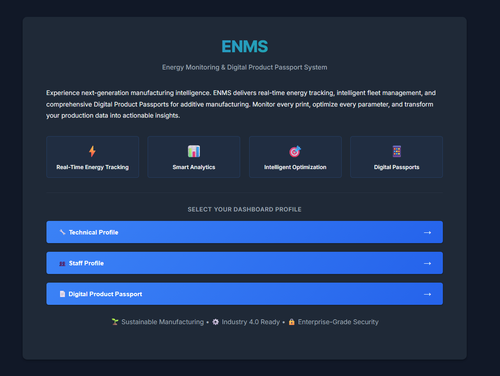
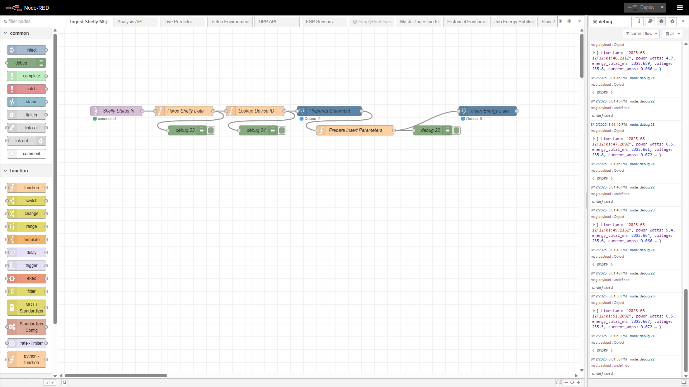
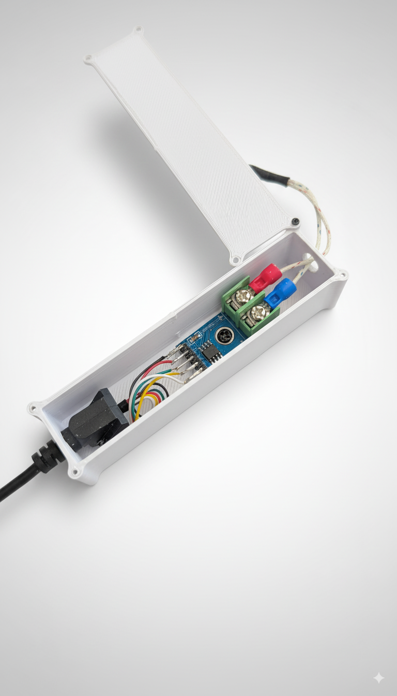

# ENMS - User Profiles & UI Guide

This comprehensive guide demonstrates the software features and artistic visualizations of the ENMS (Energy Management System) platform. It provides detailed descriptions and visual examples to enable independent verification of all system capabilities.

## Table of Contents
- [System Overview](#system-overview)
- [Welcome & Profile Selection](#welcome--profile-selection)
- [User Profiles](#user-profiles)
  - [1. Technical Profile](#1-technical-profile)
  - [2. Staff Profile](#2-staff-profile)
  - [3. DPP Profile](#3-dpp-profile)
- [Artistic Visualizations: Energy Plants](#artistic-visualizations-energy-plants)
- [Digital Product Passport (PDF Reports)](#digital-product-passport-pdf-reports)
- [Advanced Features](#advanced-features)

---

## System Overview

The ENMS Project is a **dockerized, modular IoT platform** for real-time energy monitoring and digital product passport generation in manufacturing environments. The system combines multiple technologies into a cohesive ecosystem:

### Architecture


**Key Services:**
- **PostgreSQL + TimescaleDB**: Time-series database for sensor data and job history
- **Node-RED**: Data orchestration, automation flows, and API endpoints
- **Mosquitto (MQTT)**: Real-time message broker for IoT devices
- **Python API**: Flask service for DPP summaries, PDF generation, and device management
- **Grafana**: Real-time dashboards and visualizations
- **Nginx**: Web server and reverse proxy
- **ML Worker**: Dedicated machine learning prediction service

> For detailed technical information on the backend API and architecture, see:
> - 📖 [**DPP API Documentation**](./DPP_API_Documentation.md)
> - 🔧 [**ENMS Technical Details**](./ENMS_Technical_Details.md)
> - 🤖 [**Analysis & ML Deep Dive**](./ANALYSIS_DEEP_DIVE.md)
> - 🔩 [**Custom Hardware Documentation**](./Custom%20Hardware.md)

---

## Welcome & Profile Selection

When you first access the ENMS system, you are greeted by a **Welcome Screen** that allows you to choose your user profile. This design ensures that each type of user (engineers, factory staff, or executives) sees only the tools and dashboards relevant to their role.

**How It Works:**
1. The landing page (`index.html`) displays three profile options
2. Select your profile by clicking one of the buttons
3. The interface dynamically configures itself to show the appropriate navigation menu and default tabs
4. You can change your profile at any time using the "Change Profile" button in the top navigation bar

**Available Profiles:**
- **Technical Profile**: For engineers and system administrators
- **Staff Profile**: For operations managers and factory staff
- **DPP Profile**: For executives, quality assurance, and client-facing presentations

*   **Screenshot:**
    

---

## User Profiles

## 1. Technical Profile

The Technical Profile is designed for engineers, developers, and system administrators who need deep access to the system's configuration, raw data streams, and advanced debugging tools.

**Key Capabilities:**
- Configure data ingestion flows in Node-RED
- Monitor low-level sensor data from custom ESP32 hardware
- Manage device configurations and credentials
- Retrain machine learning models
- Debug data pipelines and automation flows

### 1.1. Node-RED

*   **Description:** This tab provides direct access to the Node-RED flow editor running at `http://localhost:1880`. It is the primary tool for modifying data ingestion logic, creating new automation flows, and debugging the data pipeline. Node-RED orchestrates all data movement in the system—from MQTT subscriptions to API polling, data transformation, database insertion, and even hosting custom API endpoints like `/api/analyze`.
    
*   **Key Features:**
    *   **Visual Programming**: Drag-and-drop interface for creating data flows
    *   **MQTT Integration**: Subscribe to sensor data from Shelly plugs and ESP32 hubs
    *   **API Polling**: Automated polling of Prusa and SimplyPrint APIs
    *   **Database Operations**: Insert, query, and manage PostgreSQL data
    *   **Python Integration**: Execute Python scripts for analysis and ML predictions
    *   **Custom API Endpoints**: Host backend APIs directly within Node-RED flows
    
*   **Screenshot:**
    

#### 1.1.1. Manual Model Training

*   **Description:** Within the Node-RED editor, there is a dedicated flow named **"Manual Model Training."** This provides a simple, one-click interface to retrain the system's energy prediction AI model. When triggered, it executes the `train_model.py` script which:
    *   Fetches historical energy and operational data from PostgreSQL
    *   Engineers features like temperature deltas and one-hot encoded materials
    *   Tests multiple regression algorithms (LinearRegression, RandomForest, XGBoost, LightGBM)
    *   Selects the best performing model via K-Fold cross-validation
    *   Saves model artifacts (`best_model.joblib`, `scaler.joblib`, `model_features.joblib`) to the shared `models/` volume
    
*   **When to Use:** Retrain the model when you've collected significant new data, added new material types, or want to improve prediction accuracy.
    
*   **Location:** Look for the "Manual Model Training" flow in the Node-RED workspace, typically marked with an "inject" node for easy triggering.

### 1.2. Industrial Hybrid Edge

*   **Description:** This Grafana dashboard provides **real-time monitoring of custom ESP32 sensor hardware** deployed alongside the 3D printers. It's designed for at-a-glance verification that the IoT edge devices are functioning correctly and providing accurate telemetry.
    
*   **Key Metrics Displayed:**
    *   **Hot-End Temperature**: Direct reading from MAX6675 thermocouple amplifier with K-type probe
    *   **Power Consumption**: Real-time wattage from Shelly smart plug integration
    *   **Accelerometer Data**: 3-axis vibration readings from MPU6050 (detects printing state)
    *   **Gyroscope Data**: Rotational movement detection (future: predictive maintenance)
    *   **Ambient Conditions**: Temperature and humidity from DHT22 sensor
    
*   **Use Cases:**
    *   Diagnosing hardware-level sensor malfunctions
    *   Verifying thermocouple accuracy against printer's built-in sensors
    *   Correlating vibration signatures with print quality issues
    *   Monitoring environmental stability in the production area
    
*   **Technical Note:** This dashboard connects directly to the `environment_data` and `energy_data` hypertables in TimescaleDB. For more details on the custom sensor hub hardware, see [Custom Hardware Documentation](./Custom%20Hardware.md).
    
*   **Screenshot:**
    

### 1.3. Sensor Explorer

*   **Description:** A **comprehensive Grafana dashboard** that enables deep exploration of all sensor data collected from the ESP32 IoT hubs. This is the go-to tool for technical users who need to understand the correlation between environmental conditions, machine vibrations, and energy consumption patterns.
    
*   **Available Data Streams:**
    *   **MPU6050 Accelerometer**: X, Y, Z acceleration values (used for vibration analysis and operational state detection)
    *   **MPU6050 Gyroscope**: Rotational velocity on 3 axes
    *   **DHT22 Environmental Sensor**: Ambient temperature (°C) and relative humidity (%)
    *   **MAX6675 Thermocouple**: High-precision hot-end temperature readings
    *   **Shelly Energy Data**: Correlated power, voltage, current, and plug temperature
    
*   **Advanced Features:**
    *   **Multi-Series Overlays**: Compare multiple sensor readings on the same timeline
    *   **Custom Time Ranges**: Zoom into specific events or anomalies
    *   **Data Export**: Download raw sensor data for offline analysis
    *   **Anomaly Detection**: Identify unusual patterns or sensor failures
    
*   **Practical Applications:**
    *   **Vibration-Based State Detection**: Analyze accelerometer patterns to distinguish between "Printing," "Heating," and "Idle" states
    *   **Environmental Impact Analysis**: Correlate room temperature/humidity with print failures or energy spikes
    *   **Predictive Maintenance**: Monitor gyroscope data for bearing wear or mechanical degradation
    *   **Quality Assurance**: Link vibration anomalies to layer shifts or print defects
    
*   **Screenshot:**
    

### 1.4. Device Management

*   **Description:** This is a **powerful CRUD (Create, Read, Update, Delete) interface** that allows technical users to directly manage the printer fleet configuration stored in the PostgreSQL database. It is the primary tool for onboarding new printers or updating API credentials for existing ones.
    
*   **Key Features:**
    *   **Unified Fleet View**: Displays all registered devices in a searchable, sortable table showing device ID, model, location, and connection type
    *   **Dynamic Forms**: The "Add New Device" and "Edit" forms intelligently adapt based on printer type:
        *   **Prusa Printers**: Shows fields for `api_ip` (local network address) and `api_key` (PrusaLink authentication token)
        *   **SimplyPrint Printers**: Shows fields for `simplyprint_id`, `sp_company_id`, and `sp_api_key` (cloud service credentials)
    *   **Data Validation**: Forms enforce required fields and validate data formats (IP addresses, printer dimensions, etc.)
    *   **Contextual Help**: User-friendly tooltips (ⓘ icons) explain complex fields like SimplyPrint IDs and where to find them in the cloud dashboard
    *   **Physical Specifications**: Configure bed dimensions (width, depth in mm) and size category (Mini, Standard, XL) for accurate G-code placement visualization
    
*   **Supported Device Types:**
    *   Prusa MK4, MK3S+, Mini+ (via local PrusaLink API)
    *   SimplyPrint-connected printers (Ender-3, CR-10, etc. via cloud API)
    *   Custom or future printer types (extensible architecture)
    
*   **Backend Integration:** This interface communicates with the Python Flask API (`/api/devices/`) which performs direct SQL operations on the `devices` table. All changes are immediately reflected system-wide.
    
*   **Security Note:** This page is only accessible to users with the Technical Profile. API keys and credentials are transmitted over HTTPS in production deployments.
    
*   **Screenshot:**
    

---

---

## 2. Staff Profile

The Staff Profile is tailored for **factory managers, operations staff, and production planners** who need to monitor fleet performance, compare machine efficiency, and analyze energy usage patterns—all without needing to see or manage the underlying system configuration.

**Key Capabilities:**
- Monitor overall fleet status and machine availability
- Track job completion rates and production metrics
- Compare energy efficiency across different machines
- Identify high-consumption printers for optimization
- Analyze operational drivers affecting energy use
- Download historical job reports for compliance or billing

### 2.1. Fleet Operations

*   **Description:** This is the **primary operational dashboard** in Grafana for monitoring the entire printer fleet. It provides real-time, at-a-glance metrics that answer critical questions like "How many printers are available?" "What jobs are running?" and "What's our total energy consumption today?"
    
*   **Dashboard Sections:**
    
    **1. Fleet Status Overview:**
    *   **Machine States**: Real-time count of printers in each state (Printing, Idle, Heating, Offline, Error)
    *   **Utilization Rate**: Percentage of fleet actively producing vs. idle
    *   **Availability**: Number of printers ready for new jobs
    
    **2. Energy Metrics:**
    *   **Total Fleet Energy (24h)**: Cumulative kWh consumed by all printers in the last 24 hours
    *   **Real-Time Power Draw**: Current total wattage across the fleet
    *   **Energy Cost Estimation**: Calculated energy expenses based on configurable utility rates
    *   **Energy per Job**: Average kWh consumed per completed print job
    
    **3. Recent Print Jobs Table:**
    *   **Columns**: Printer Name, Job Filename, Energy Consumed (kWh), Duration, Material Used, Completion Time, Report Download
    *   **Sorting**: Click column headers to sort by any metric
    *   **Filtering**: Search by filename or printer name
    *   **Pagination**: Browse through historical jobs with page controls
    
    **4. Production Metrics:**
    *   **Jobs Completed Today**: Count of successfully finished prints
    *   **Total Material Used**: Cumulative filament consumption (grams) across the fleet
    *   **Average Job Duration**: Mean print time for completed jobs
    
*   **Screenshot:**
    

#### **Downloading Job Reports (Digital Product Passport)**

A key feature of the "Recent Print Jobs" table on this dashboard is the ability to download a permanent record for any completed print.

*   **PDF Report Icon**: In the "Report" column, a <i class="fas fa-file-pdf"></i> **PDF icon** will appear for any job that has a generated report.
*   **Purpose**: Clicking this icon downloads a detailed, single-page **Digital Product Passport (DPP)** for that specific job.
*   **Content**: This PDF contains the final, authoritative data for the print, including:
    *   **Energy Summary**: Total kWh consumed and session duration
    *   **Material Traceability**: Filament type (PLA, PETG, ASA, etc.) and quantity used (grams)
    *   **G-code Metadata**: Object name, layer height, infill density, nozzle diameter, slicer profile
    *   **Temperature Profile**: Nozzle and bed temperatures used during printing
    *   **Visual Certificate**: The final "Energy Plant" image (see [Artistic Visualizations](#artistic-visualizations-energy-plants)) providing a visual summary of the job's energy footprint
    *   **Thumbnail Preview**: Embedded image of the 3D model (extracted from G-code)

*   **Use Cases**:
    *   **Quality Assurance**: Attach DPP to physical part for full manufacturing traceability
    *   **Compliance & Auditing**: Demonstrate energy efficiency for sustainability reporting
    *   **Client Transparency**: Provide customers with verifiable energy consumption data
    *   **Billing & Cost Allocation**: Use energy data for internal cost center chargebacks


### 2.2. Performance Comparison

*   **Description:** A Grafana dashboard specifically designed to **compare the efficiency and performance of different machines** in the fleet. This tool helps identify which printers are most cost-effective for specific types of jobs and reveal opportunities for optimization.
    
*   **Comparison Metrics:**
    
    **Energy Efficiency:**
    *   **kWh per Job**: Average energy consumed per completed print (lower is better)
    *   **kWh per Gram**: Energy efficiency relative to material used (identifies inefficient heating)
    *   **Power Draw Distribution**: Histogram showing typical wattage for each machine
    
    **Time Performance:**
    *   **Average Job Duration**: Mean print time across all jobs
    *   **Idle Time Percentage**: How much time the printer sits unused but powered
    *   **Heating Phase Duration**: Time spent reaching target temperatures (indicates thermal efficiency)
    
    **Utilization Metrics:**
    *   **Jobs Completed**: Total production output per machine
    *   **Material Consumption**: Total filament used (grams)
    *   **Uptime vs. Downtime**: Operational availability over selected period
    
    **Cost Analysis:**
    *   **Total Energy Cost**: Estimated electricity expenses per machine
    *   **Cost per Part**: Energy cost divided by number of completed jobs
    *   **ROI Comparison**: Useful for evaluating equipment purchase decisions
    
*   **Use Cases:**
    *   **Fleet Optimization**: Retire or replace inefficient machines
    *   **Job Routing**: Assign jobs to the most energy-efficient printer for that material/size
    *   **Maintenance Scheduling**: Identify machines with degrading efficiency (possible hardware issues)
    *   **Capacity Planning**: Understand true productivity of each machine for expansion decisions
    
*   **Interactive Features:**
    *   **Time Range Selection**: Compare performance over different periods (day, week, month)
    *   **Machine Selection**: Toggle specific printers on/off to focus comparisons
    *   **Material Filtering**: Compare performance only for specific filament types
    
*   **Screenshot:**
    

### 2.3. Interactive Analysis

*   **Description:** This view loads the custom **Interactive Analysis Page** (`analysis_page.html`), a powerful tool for understanding what drives your printers' energy consumption. Unlike the real-time dashboards, this feature performs **statistical analysis and machine learning-based insights** on historical data to help you make data-driven decisions about energy savings.
    
*   **How to Use:**
    
    **Step 1: Configuration Panel (Left Side)**
    1. **Select Device**: Choose which printer to analyze from the dropdown
    2. **Select Time Range**: Pick the analysis window (`1h`, `6h`, `24h`, `7d`, or `All`)
    3. **Select Drivers**: Choose operational factors to correlate with energy use:
        - **Temperature Drivers**: Nozzle Temp, Bed Temp (heating cycles)
        - **State Drivers**: Is Printing, Z-Height (active vs. idle consumption)
        - **Environmental Drivers**: Ambient Temp, Ambient Humidity (room conditions)
        - **Material Drivers**: Filament Type (PLA, PETG, ASA energy profiles)
    4. **Run Analysis**: Click the button to execute the backend analysis
    
    **Step 2: Results Panel (Right Side)**
    
    The system returns comprehensive insights structured as follows:
    
    **A. Key Metrics Summary:**
    *   **Total Energy**: Cumulative kWh consumed during the analysis period
    *   **Avg Power (Overall)**: Mean wattage including idle time
    *   **Avg Power (Active)**: Mean wattage during active operation (>5W threshold)
    *   **Energy Efficiency**: kWh per gram of filament used
    
    **B. Energy Breakdown by Phase:**
    
    The analysis automatically categorizes printer activity into three phases:
    *   **Printing**: Active print head movement and extrusion
    *   **Active (Other)**: Heated but not printing (e.g., bed adhesion wait time, cooling)
    *   **Idle**: Minimal power draw (<5W)
    
    Displays:
    *   **Data Table**: Time spent and energy consumed in each phase
    *   **Pie Charts**: Visual comparison of time allocation vs. energy allocation
    
    **Key Insight**: If "Active (Other)" consumes significant energy, you may have unnecessary heated idle time—prime target for workflow optimization.
    
    **C. Driver Correlation Analysis:**
    
    Shows the statistical relationship between selected drivers and power consumption:
    *   **Correlation Coefficient** (-1 to +1): How strongly each driver affects energy use
        - **+0.7 to +1.0**: Strong positive correlation (driver increases → energy increases)
        - **-0.7 to -1.0**: Strong negative correlation (driver increases → energy decreases)
        - **-0.3 to +0.3**: Weak or no relationship
    *   **Practical Example**: If "Nozzle Temp" shows +0.85, increasing nozzle temperature significantly raises energy consumption
    
    **D. ML-Based Feature Importance:**
    
    Uses the trained XGBoost regression model to identify which factors the AI considers most predictive of energy consumption:
    *   **Top Influencing Factors**: Ranked list of features by importance score
    *   **Includes Engineered Features**: Temperature deltas, one-hot encoded materials
    *   **Actionable**: Focus optimization efforts on the highest-ranked factors
    
    **E. Automated Insights:**
    
    Plain-English summary bullets automatically generated, such as:
    - "65% of energy was consumed during the Printing phase"
    - "Nozzle temperature is the strongest predictor of power consumption"
    - "Ambient humidity shows minimal impact on energy use"
    
    **F. Potential Actions & Suggestions:**
    
    Context-aware recommendations based on the analysis results:
    - "Reduce bed temperature by 5-10°C for PLA prints to save energy"
    - "Implement auto-shutdown after print completion to eliminate idle consumption"
    - "Pre-heat printers just before job start rather than keeping them heated"
    
*   **Advanced Features:**
    *   **Show Advanced Details**: Reveals full statistical output (correlation matrices, p-values)
    *   **Grafana Integration**: Provides direct links to drill-down dashboards for the analyzed period
    *   **Data Downsampling**: Automatically uses aggregated data for long time ranges (7+ days) to maintain performance
    
*   **Technical Backend:** This feature is powered by a Node-RED-hosted API endpoint (`/api/analyze`) that:
    1. Constructs dynamic SQL queries joining `energy_data`, `printer_status`, and `environment_data` tables
    2. Passes the unified dataset to a Python analysis script
    3. Executes statistical analysis (correlation, phase detection) and ML model inference
    4. Returns formatted JSON results to the frontend
    
*   **For Complete Documentation**: See the [Definitive Guide to Interactive Analysis](./INTERACTIVE&ANALYSIS_GUIDE.md) for detailed technical architecture and step-by-step user instructions.
    
*   **Screenshot:**
    

    
---
    
## 3. DPP Profile

The DPP (Digital Product Passport) Profile is a specialized, **visually-rich presentation view** designed to showcase the manufacturing process in real-time. It is ideal for:
- **Executive Dashboards**: High-level overview for management without technical complexity
- **Client Demonstrations**: Impressive, easy-to-understand visualization of the production floor
- **Quality Assurance**: Quick verification of job status and energy compliance
- **Trade Shows & Marketing**: Public-facing display of sustainability efforts

**Key Philosophy**: The DPP Profile uses **artistic metaphors and gamification** to make complex energy data immediately understandable to non-technical audiences.

### 3.1. DPP View

*   **Description:** This tab loads the custom **DPP Page** (`dpp_page.html`), which presents the printer fleet as an **interactive 3D carousel of "Digital Product Passport" cards**. Each card is a living, real-time dashboard for a single printer, combining live status, job progress, energy metrics, and artistic visualizations into one elegant interface.
    
*   **Card Structure:**
    
    Each printer is represented by a **dual-sided card** that can be flipped to reveal different information:
    
    **Front Side (Live Status):**
    *   **Header**: Printer name, model, and current operational state (with color-coded status indicators)
    *   **Energy Plant Visualization**: Real-time growing plant representing cumulative energy consumption (see [Artistic Visualizations](#artistic-visualizations-energy-plants))
    *   **Live Metrics**:
        - Current job filename and progress percentage
        - Real-time energy consumption for active job (kWh)
        - Time remaining estimate
        - Material type currently loaded
    *   **Temperature Gauges**: Visual indicators for nozzle and bed temperatures
    *   **3D G-code Preview**: Live rendering of the part being printed using Three.js
    *   **Job Progress Bar**: Visual indicator with percentage completion
    
    **Back Side (Historical Analysis):**
    *   **Recent Print History**: Table of last 5 completed jobs with energy consumption
    *   **24-Hour Energy Summary**: Total kWh consumed in the last day
    *   **Last Job Details**: Energy, duration, material used for most recent completed print
    *   **Flip Back Button**: Return to live status view
    
*   **Interactive Features:**
    
    **1. Card Flipping:**
    *   Click on any card to flip it and reveal historical data
    *   Cards have smooth 3D rotation animation with `transform-style: preserve-3d`
    *   Only the active (centered) card can be flipped
    
    **2. Carousel Navigation:**
    *   **Swiper.js Integration**: Smooth 3D carousel effect with perspective transforms
    *   **Active Card Scaling**: The centered card scales up (1.22x) and comes forward (translateZ)
    *   **Adjacent Card Preview**: Previous/next cards are visible but slightly smaller and rotated
    *   **Navigation Arrows**: Click arrows or swipe to browse through the fleet
    *   **Keyboard Navigation**: Arrow keys for accessibility
    
    **3. Live 3D G-code Rendering:**
    *   **Three.js + GCodeLoader**: Real-time 3D visualization of the part being printed
    *   **Camera Controls**: OrbitControls for rotating, zooming, and panning the model
    *   **Build Plate Representation**: Accurate bed size based on printer dimensions from database
    *   **Layer-by-Layer Preview**: Shows the model as it will be printed
    *   **Automatic Scaling**: Model is sized to fit the printer's bed dimensions
    
    **Technical Implementation**: The system fetches the G-code file URL from the database (for Prusa: `gcodePath` from PrusaLink, for SimplyPrint: pre-generated thumbnails), downloads it, and parses it using Three.js GCodeLoader to render the toolpath in 3D.
    
    **4. Real-Time Updates:**
    *   Cards refresh every 15-30 seconds with latest data from `/api/dpp_summary`
    *   Energy plant images animate smoothly when stage changes
    *   Progress bars and metrics update live during active prints
    
*   **Global History Section:**
    
    Below the carousel is a **paginated table of all recently completed jobs across the entire fleet**:
    *   **Columns**: Printer Name, Job Filename, Energy (kWh), Completion Time, Thumbnail Preview, PDF Report Download
    *   **Search Functionality**: Filter jobs by filename or printer name
    *   **Pagination Controls**: Browse through hundreds of historical jobs
    *   **Server-Side Filtering**: Efficient handling of large datasets via backend API
    
*   **Screenshot:**
    

#### **Downloading Job Reports (Digital Product Passport)**

The DPP view provides **two locations** to download PDF reports:

**Location 1: Individual Printer History (Card Back Side)**
*   When you flip a card, the "Recent Jobs" table shows the last 5 prints for that specific printer
*   Click the <i class="fas fa-file-pdf"></i> PDF icon to download the DPP for that job

**Location 2: Global History Table**
*   The master table below the carousel shows ALL completed jobs across the fleet
*   In the "Report" column, click the <i class="fas fa-file-pdf"></i> PDF icon for any job

**PDF Report Content** (identical across all download locations):
*   **Manufacturing Summary**: Printer model, completion timestamp, session duration
*   **Energy Traceability**: Total kWh consumed, energy cost estimate, efficiency metrics
*   **Material Documentation**: Filament type, grams used, material sustainability data
*   **G-code Metadata**: Automatically extracted slicer settings:
    - Object name and dimensions (mm)
    - Layer height and infill density (%)
    - Nozzle diameter and supports enabled
    - Slicer profile name (e.g., "Prusament PLA Quality 0.2mm")
*   **Temperature Profile**: Nozzle and bed temperatures used during print
*   **Visual Certificate**: **Energy Plant Image** - the artistic visualization showing energy consumption stage (see next section)
*   **3D Thumbnail**: Embedded preview image extracted from G-code file
*   **QR Code**: (Future feature) Links to full manufacturing data in blockchain or audit system

**Backend Process**: When you click download, the system:
1. Queries PostgreSQL for complete job data (joining `print_jobs`, `devices`, and `printer_status` tables)
2. Selects the appropriate plant image based on energy consumption and printer's `plant_type`
3. Renders an HTML template (`dpp_job_report.html`) with all data
4. Uses **WeasyPrint** library to convert HTML→PDF with embedded images
5. Saves PDF to shared `generated_pdfs/` volume
6. Nginx serves the file via `/dpp_reports/<filename>.pdf`

---

## Artistic Visualizations: Energy Plants

One of the most unique features of the ENMS platform is the **Energy Plant Visualization System**—an artistic approach to making energy consumption data immediately understandable through natural growth metaphors.

### Concept & Philosophy

**The Problem**: Raw energy numbers (kWh, Watts) are abstract and difficult for non-technical audiences to contextualize. Is 0.5 kWh a lot or a little? How does today's consumption compare to yesterday?

**The Solution**: The system uses **plant growth and decline as a visual metaphor** for cumulative energy consumption and environmental impact. The visualization has two phases:

1. **Growth Phase (Low Energy)**: As the printer consumes small amounts of energy, the plant grows from seed to healthy maturity—representing sustainable, efficient operation.
2. **Decline Phase (High Energy)**: As energy consumption increases beyond optimal levels, the plant begins to **wilt, brown, and eventually die**—representing the negative environmental impact of excessive energy use.

**The Message**: Operators can literally "see" when their energy consumption is "killing the planet" through the dying plant imagery. This creates powerful visual feedback to encourage energy efficiency.

**Key Design Principles**:
- **Intuitive**: Everyone understands plant growth AND death—no technical knowledge required
- **Gamified**: Creates engagement and emotional connection to energy efficiency ("keep the plant healthy!")
- **Powerful Messaging**: Wilting/dying plants provide visceral reminder of environmental consequences
- **Sustainable Messaging**: Reinforces that excessive energy consumption has environmental impact
- **Scalable**: Plant imagery works across cultures and languages
- **Honest**: Doesn't sugarcoat high consumption—shows the real impact

### How It Works

**1. Energy-to-Stage Mapping:**

Each printer has a cumulative energy counter that tracks total kWh consumed over its lifetime (or since last reset). This energy value is mapped to a **growth stage** between 1 and 21:

| Energy Range (kWh) | Growth Stage | Visual Representation |
|--------------------|--------------|----------------------|
| 0.000 - 0.003 | Stage 1 | Seed / bare soil |
| 0.003 - 0.006 | Stage 2 | Sprout emerging |
| 0.006 - 0.010 | Stage 3-7 | Seedling with first leaves |
| 0.010 - 0.100 | Stage 8-11 | Juvenile plant, growing height |
| 0.100 - 1.000 | Stage 12-16 | Mature plant, full foliage (peak health) |
| 1.000 - 3.000+ | Stage 17-21 | **Plant wilting and dying** (high energy consumption) |

**Important**: The later stages (17-21) deliberately show the plant **wilting, browning, and eventually dying**. This symbolizes **excessive energy consumption** and its negative environmental impact. The metaphor is: just as over-consuming resources kills a plant, high energy usage harms the environment.

**Technical Note**: The exact thresholds are defined in `python-api/dpp_simulator.py` in the `PLANT_THRESHOLDS` array. The system uses a modulo operation for very high energy values, allowing the plant to "cycle" back to stage 1 and grow again—creating an endless growth metaphor.

**2. Plant Type Selection:**

The system includes **four distinct plant types**, each representing the **source material of the filament** (bio-based or plant-derived polymers). Each plant type has its own unique artistic style and number of growth stages:

#### **A. Generic Plant** (Default)
- **Stages**: 21 (most granular progression)
- **Represents**: Generic bio-based polymer source (default/fallback)
- **Visual Style**: Abstract, stylized plant suitable for any industrial context
- **Growth to Decline**: Stages 1-15 show healthy growth, stages 16-21 show gradual wilting and death
- **Use Case**: Default for all printers unless manually assigned a specific plant type
- **File Location**: `/artistic-resources/plants/generic_plant/generic_plant_stage_01.png` through `generic_plant_stage_21.png`

[TODO: Screenshot needed - Example of Generic Plant at different stages showing growth and wilting]

#### **B. Corn (Maize)**
- **Stages**: 8
- **Represents**: Corn-based PLA (polylactic acid) filament source material
- **Visual Style**: Realistic corn plant from seed to mature stalk, then decline
- **Growth to Decline**: Stages 1-5 show healthy growth, stages 6-8 show wilting/dying plant
- **Symbolism**: Represents corn-derived bioplastic commonly used in 3D printing
- **Use Case**: Assign to printers primarily using PLA filament
- **File Location**: `/artistic-resources/plants/corn/corn_stage_01.png` through `corn_stage_08.png`

[TODO: Screenshot needed - Corn plant progression from growth to wilting]

#### **C. Sunflower**
- **Stages**: 7
- **Represents**: Sunflower-based or other plant oil-derived filament materials
- **Visual Style**: Sunflower from seed to full bloom, then decline
- **Growth to Decline**: Stages 1-4 show healthy growth and blooming, stages 5-7 show wilting petals and dying plant
- **Symbolism**: Represents plant oil-based polymers and bio-composites
- **Use Case**: Ideal for printers using specialty bio-composite filaments
- **File Location**: `/artistic-resources/plants/sunflower/sunflower_stage_01.png` through `sunflower_stage_07.png`

[TODO: Screenshot needed - Sunflower progression from bloom to wilting]

#### **D. Potato**
- **Stages**: 12
- **Represents**: Potato starch-based bioplastic filament source material
- **Visual Style**: Potato plant from seedling to mature foliage, then decline
- **Growth to Decline**: Stages 1-8 show healthy growth, stages 9-12 show progressive wilting and plant death
- **Symbolism**: Represents potato starch-derived polymers used in biodegradable filaments
- **Use Case**: Assign to printers using starch-based or biodegradable filament materials
- **File Location**: `/artistic-resources/plants/potato/potato_stage_01.png` through `potato_stage_12.png`

[TODO: Screenshot needed - Potato plant progression from growth to wilting]

**3. Assignment & Configuration:**

Plant types are assigned per printer in the **devices table** in PostgreSQL based on the **filament material** typically used:

```sql
-- Example: Assign corn plant to a PLA printer (corn-based filament)
UPDATE devices 
SET plant_type = 'corn' 
WHERE device_id = 'PrusaMK4-1';

-- Example: Assign potato plant to a biodegradable filament printer
UPDATE devices 
SET plant_type = 'potato'
WHERE device_id = 'Ender3-2';

-- Example: Assign sunflower to specialty bio-composite printer
UPDATE devices 
SET plant_type = 'sunflower' 
WHERE device_id = 'PrusaMini-3';
```

**Recommended Mapping**:
- **'corn'**: For printers using standard PLA (polylactic acid from corn)
- **'potato'**: For biodegradable or starch-based filaments
- **'sunflower'**: For specialty bio-composites or plant oil-based materials
- **'generic_plant'**: Default for mixed-use printers or non-bio materials

This can be done via the Device Management interface or directly in the database.

### Where You'll See Energy Plants

**1. DPP Card Front Side:**
- Large, prominent plant image centered on the card
- Updates in real-time as printer consumes energy during active jobs
- Shows current cumulative energy stage for that specific printer
- Provides immediate visual feedback: "Has this printer been working hard?"

**2. PDF Reports (Digital Product Passport):**
- Final plant stage embedded in the report as a "visual certificate"
- Represents total energy consumed for that specific print job
- Permanent record: the plant image is frozen at completion time
- Useful for client communication: "This part used the equivalent of growing a plant to Stage 12"

**3. Historical Displays:**
- Fleet comparison views can show plant stages side-by-side
- Quickly identify which printers have highest cumulative energy usage

### Technical Implementation

**Frontend (JavaScript):**
```javascript
function getPlantImageSrc(plantType, plantStage) {
    const plantTypeClean = plantType ? plantType.toLowerCase() : 'generic_plant';
    let stage = parseInt(plantStage);
    let maxStagesForDisplay = 21; // Default for generic_plant
    
    // Adjust for specific plant types
    if (plantTypeClean === 'corn') {
        maxStagesForDisplay = 8;
    } else if (plantTypeClean === 'sunflower') {
        maxStagesForDisplay = 7;
    } else if (plantTypeClean === 'potato') {
        maxStagesForDisplay = 12;
    }
    
    // Ensure stage is within valid range
    stage = Math.min(stage, maxStagesForDisplay);
    stage = Math.max(stage, 1);
    
    const stage_padded = String(stage).padStart(2, '0');
    return `/artistic-resources/plants/${plantTypeClean}/${plantTypeClean}_stage_${stage_padded}.png`;
}
```

**Backend (Python):**
```python
# In python-api/dpp_simulator.py and pdf_service.py

PLANT_THRESHOLDS = [0.003, 0.006, 0.007, 0.0073, 0.008, 0.009, 0.01, 
                     0.0133, 0.015, 0.0167, 0.02, 0.333, 0.4, 0.467, 
                     0.533, 0.6, 0.667, 0.833, 1.0]

def get_plant_stage(kwh):
    """
    Maps energy consumption (kWh) to plant growth stage (1-21).
    Uses modulo to allow infinite growth cycles.
    """
    kwh_val = float(kwh) if kwh else 0.0
    CYCLE_THRESHOLD = 1.0  # Energy for one full growth cycle
    
    # Calculate effective kWh within current growth cycle
    effective_kwh = kwh_val % CYCLE_THRESHOLD
    
    # Map to stage based on thresholds
    if effective_kwh < PLANT_THRESHOLDS[0]: 
        return 1
    
    for i in range(len(PLANT_THRESHOLDS) - 1, -1, -1):
        if effective_kwh >= PLANT_THRESHOLDS[i]: 
            return min(i + 2, 21)
    
    return 1
```

### Customization & Extensions

**Adding New Plant Types:**

1. Create new directory in `/artistic-resources/plants/your_plant_name/`
2. Add PNG images named `your_plant_name_stage_01.png`, `_02.png`, etc.
3. Update `PLANT_TYPES` array in `python-api/dpp_simulator.py`
4. Modify `getPlantImageSrc()` function in `frontend/dpp_page.html` to handle new plant
5. Add stage count logic for your plant's specific number of images

**Adjusting Growth Thresholds:**

Edit `PLANT_THRESHOLDS` array in `python-api/dpp_simulator.py` and `python-api/pdf_service.py` to change how quickly plants grow relative to energy consumption.

**Use Cases for Custom Plants:**
- **Automotive Industry**: Use car assembly imagery (parts → finished vehicle → rusted/scrapped car)
- **Construction**: Building construction stages (foundation → completed structure → demolition/decay)
- **Technology**: Circuit board assembly (bare board → fully populated → broken/corroded)
- **Seasonal Themes**: Holiday-specific imagery for marketing events
- **Other Filament Sources**: Create plants for hemp, algae, bamboo, or other bio-based materials

**Important**: Always include a **decline/negative phase** in later stages to maintain the sustainability message that excessive consumption has consequences.

### Educational Value

The Energy Plant visualization serves multiple purposes beyond aesthetics:

**Sustainability Awareness:**
- Makes abstract energy consumption tangible and memorable
- **Wilting/dying plants create emotional impact**: Operators don't want to "kill" their plant
- Encourages operators to think about energy efficiency in a visceral way
- Creates friendly competition between shifts to "keep the plants alive and healthy"
- Provides immediate, honest feedback: "Your energy usage is harming the environment"

**Client Communication:**
- Easy to explain to non-technical stakeholders: "See how the plant dies when we use too much energy?"
- Visually impressive and memorable in client presentations
- Demonstrates commitment to honest sustainability tracking (not greenwashing)
- Shows clients you're serious about minimizing environmental impact

**Team Engagement:**
- Gamification creates emotional investment in efficiency
- **Negative feedback (dying plant) is more motivating than positive alone**
- Visual feedback is more engaging than raw numbers
- Can track "plant health" over time as a team KPI
- Operators take pride in maintaining "healthy" plants (low energy jobs)

**Behavioral Psychology:**
- **Loss aversion**: People are more motivated to prevent plant death than to achieve growth
- Immediate visual consequences create behavioral change
- Associates high energy use with negative outcome (death) at a subconscious level

---

## Digital Product Passport (PDF Reports)

### Report Generation Architecture

The ENMS system automatically generates comprehensive **Digital Product Passport (DPP) PDF reports** for every completed print job. This feature transforms the platform into a complete manufacturing documentation system.

### Generation Process

**Trigger**: When a print job completes, Node-RED detects the status change and initiates the PDF generation workflow.

**Backend Pipeline**:

1. **Data Aggregation** (PostgreSQL):
   - Node-RED queries the database to retrieve complete job data
   - Joins multiple tables: `print_jobs`, `devices`, `printer_status`
   - Extracts G-code metadata from `gcode_analysis_data` JSONB column

2. **API Call** (Node-RED → Python Flask):
   - Makes POST request to `/api/generate_dpp_pdf` with `job_id`
   - Python Flask service (`pdf_service.py`) receives request

3. **Template Rendering** (Jinja2):
   - Loads HTML template: `templates/dpp_job_report.html`
   - Inserts dynamic data: energy metrics, timestamps, material info
   - Selects appropriate plant image based on energy stage calculation
   - Embeds 3D thumbnail extracted from G-code (PNG or QOI format)

4. **PDF Conversion** (WeasyPrint):
   - Converts rendered HTML to PDF with embedded images
   - Handles CSS styling for professional layout
   - Generates file path: `/generated_pdfs/report_<job_id>.pdf`

5. **Storage & Serving** (Docker Volumes + Nginx):
   - PDF saved to shared Docker volume (`generated_pdfs`)
   - Nginx serves file via `/dpp_reports/<filename>.pdf`
   - URL stored in database for future retrieval

### G-code Analysis & Metadata Extraction

**Automatic Processing**: When a job starts or completes, the system automatically analyzes the G-code file using `gcode_analyzer.py`.

**Extracted Metadata**:
- **Object Information**: Part name, estimated print time, filament quantity
- **Slicer Settings**: Layer height, infill density, nozzle diameter, support structures
- **Material Specifications**: Filament type, manufacturer, color
- **Physical Dimensions**: Bounding box (X, Y, Z) in millimeters
- **Slicer Profile**: Complete profile name (e.g., "0.2mm QUALITY @MK4")

**Thumbnail Handling**:
- **Prusa Format**: QOI (Quite OK Image) format embedded in G-code comments
- **Universal Format**: Standard PNG images encoded in Base64
- **Multi-Resolution Support**: Automatically selects highest resolution thumbnail available
- **QOI Decoder**: Custom Python implementation converts proprietary format to web-safe PNG
- **Fallback**: If no thumbnail found, system uses placeholder image

**Storage**: All metadata stored in `print_jobs.gcode_analysis_data` as structured JSONB for efficient querying.

### Report Content Details

**Page 1: Manufacturing Certificate**

**Header Section**:
- Company logo and branding (customizable)
- "Digital Product Passport" title
- Unique Job ID and QR code (future: blockchain verification)

**Manufacturing Summary**:
- **Printer**: Model, serial number, friendly name
- **Completion Time**: ISO 8601 timestamp with timezone
- **Total Duration**: Human-readable format (e.g., "2h 34m 18s")
- **Status**: Success, Failed, or Cancelled with reason

**Energy & Sustainability Metrics**:
- **Total Energy Consumed**: kWh with 3 decimal precision
- **Energy Cost Estimate**: Calculated from configurable utility rate
- **Carbon Footprint**: CO₂ equivalent (based on regional grid mix)
- **Energy Plant Visualization**: Artistic representation of consumption

**Material Traceability**:
- **Filament Type**: PLA, PETG, ASA, TPU, etc.
- **Manufacturer & Brand**: (if available in G-code)
- **Quantity Used**: Grams and estimated meters
- **Material Sustainability**: Recyclability status, bio-based percentage

**G-code Technical Specifications**:
- **Object Name**: Filename or embedded model name
- **Physical Dimensions**: X × Y × Z in millimeters
- **Layer Height**: Microns or millimeters
- **Infill Density**: Percentage
- **Nozzle Diameter**: Millimeters
- **Supports Enabled**: Yes/No
- **Slicer Profile**: Complete profile name

**Temperature Profile**:
- **Nozzle Temperature**: Target and actual average
- **Bed Temperature**: Target and actual average
- **Ambient Conditions**: Room temp/humidity during print (if available)

**Visual Elements**:
- **3D Thumbnail**: Preview of the printed object
- **Energy Plant**: Final growth stage image
- **QR Code**: Links to online verification or full data export

### Use Cases

**Quality Assurance**:
- Attach DPP to physical part as manufacturing certificate
- Verify print parameters match quality requirements
- Trace any defects back to specific environmental or machine conditions

**Compliance & Auditing**:
- Demonstrate energy efficiency for ISO 14001 or similar certifications
- Provide verifiable data for sustainability reports
- Meet regulatory requirements for manufacturing documentation

**Client Transparency**:
- Share DPPs with customers to prove eco-friendly production
- Include energy cost in pricing calculations
- Differentiate from competitors with verifiable sustainability data

**Internal Operations**:
- Cost center chargebacks based on energy consumption
- Identify high-energy jobs for process optimization
- Historical record for troubleshooting recurring issues

---

## Advanced Features

### Live Energy Prediction (ML Worker)

**Description**: The system includes a dedicated **Machine Learning Worker** service that provides real-time energy consumption predictions for active print jobs.

**Architecture**:
- **Decoupled Design**: ML worker runs as separate Docker container to prevent resource contention
- **MQTT Communication**: Node-RED publishes prediction requests to MQTT broker
- **Async Processing**: Worker processes one request at a time, queuing others to prevent CPU overload
- **Model Artifacts**: Loads trained XGBoost model from shared `/models` volume

**How It Works**:

1. **Data Collection**: Node-RED periodically queries latest printer status (temps, progress, material)
2. **Request Publishing**: Sends JSON payload to MQTT topic: `enms/prediction/request`
3. **ML Inference**: Worker service:
   - Loads current status data
   - Engineers features (temp deltas, one-hot encoded materials)
   - Scales inputs using saved `scaler.joblib`
   - Runs XGBoost model prediction
   - Returns predicted power (Watts)
4. **Result Publishing**: Worker sends prediction to `enms/prediction/result/<device_id>`
5. **Database Storage**: Node-RED stores prediction in `ml_predictions` table
6. **Frontend Display**: Real-time predictions shown on DPP cards and dashboards

**Model Features**:
- **Input Features**: Nozzle temp (actual & target), bed temp (actual & target), Z-height, material type (one-hot), ambient conditions
- **Engineered Features**: Temperature deltas (target - actual) capture heating effort
- **Output**: Predicted instantaneous power consumption in Watts
- **Accuracy**: Typically R² > 0.85 after training on diverse job data

**Use Case**: Compare predicted vs. actual power to detect anomalies like heating element degradation or unusual energy draw.

### G-code 3D Preview System

**Description**: Live 3D rendering of G-code toolpaths directly in the browser using Three.js.

**Technology Stack**:
- **Three.js**: WebGL-based 3D graphics library
- **GCodeLoader**: Custom loader addon for parsing G-code into 3D geometry
- **OrbitControls**: Mouse/touch controls for rotating, zooming, panning
- **Custom Shaders**: Color-coded layers and extrusion paths

**Features**:
- **Live Loading**: Fetches G-code file from Prusa API or local storage
- **Layer Visualization**: Different colors for different layer heights
- **Build Plate**: Accurate representation of printer bed dimensions
- **Print Progress**: Can highlight completed vs. remaining layers during active print
- **Export Options**: Screenshot capability for documentation

**Performance**: Optimized for large files (>10MB G-code) using progressive loading and geometry simplification.

### Custom Hardware Integration

**ESP32 Sensor Hub**: The system integrates custom IoT sensor hubs for enhanced monitoring.


**Components**:
- **ESP32 Microcontroller**: WiFi-enabled, dual-core processor
- **MPU6050**: 6-axis accelerometer + gyroscope for vibration analysis
- **DHT22**: Temperature and humidity sensor for ambient conditions
- **MAX6675**: K-type thermocouple amplifier for precision temperature measurement



**Data Flow**:
1. ESP32 reads sensors every 1-5 seconds
2. Publishes readings to MQTT topics: `enms/sensor/<device_id>/accel`, `/gyro`, `/ambient`, `/thermocouple`
3. Node-RED subscribes to topics and inserts into `environment_data` TimescaleDB hypertable
4. Grafana dashboards query hypertable for visualization

**Advanced Applications**:
- **Vibration-Based State Detection**: Train ML model to detect "Printing" vs. "Idle" from accelerometer signature
- **Predictive Maintenance**: Monitor gyroscope data for bearing degradation patterns
- **Print Failure Detection**: Sudden vibration changes indicate layer shifts or nozzle clogs
- **Environmental Correlation**: Link humidity spikes to print warping or adhesion failures

**Hardware Documentation**: Full schematics, firmware code, and assembly instructions available in [Custom Hardware.md](./Custom%20Hardware.md).

---

## Summary & Quick Reference

### Service Access URLs (Default Docker Deployment)

| Service | URL | Profile Access |
|---------|-----|----------------|
| Main UI | `http://localhost/` | All |
| Node-RED | `http://localhost:1880` | Technical |
| Grafana | `http://localhost:3000` | Technical, Staff |
| Python API | `http://localhost/api/dpp_summary` | Backend (programmatic) |
| DPP Reports | `http://localhost/dpp_reports/*.pdf` | All (via download links) |
| G-code Previews | `http://localhost/gcode_previews/*.png` | All (embedded in UI) |

### User Profile Quick Guide

**Need to add a printer?** → Switch to **Technical Profile** → Device Management

**Need to check fleet status?** → Switch to **Staff Profile** → Fleet Operations

**Need to impress a client?** → Switch to **DPP Profile** → Carousel view

**Need to optimize energy usage?** → Switch to **Staff Profile** → Interactive Analysis

**Need to debug sensor issues?** → Switch to **Technical Profile** → Sensor Explorer

### Documentation Cross-References

- 📖 **API Documentation**: [DPP_API_Documentation.md](./DPP_API_Documentation.md) - Complete REST API reference
- 🤖 **ML & Analysis**: [ANALYSIS_DEEP_DIVE.md](./ANALYSIS_DEEP_DIVE.md) - Machine learning architecture
- 📊 **Interactive Analysis**: [INTERACTIVE_ANALYSIS_GUIDE.md](./INTERACTIVE_ANALYSIS_GUIDE.md) - Step-by-step user guide
- 🔧 **System Architecture**: [ENMS_Technical_Details.md](./ENMS_Technical_Details.md) - Full technical documentation
- 🔩 **Hardware**: [Custom Hardware.md](./Custom%20Hardware.md) - ESP32 sensor hub details
- 🚀 **Setup**: [README.md](./README.md) - Deployment and quick start guide

---

**Last Updated**: 2025-12-08  
**Version**: 2.0 - Comprehensive Documentation with Artistic Visualizations

