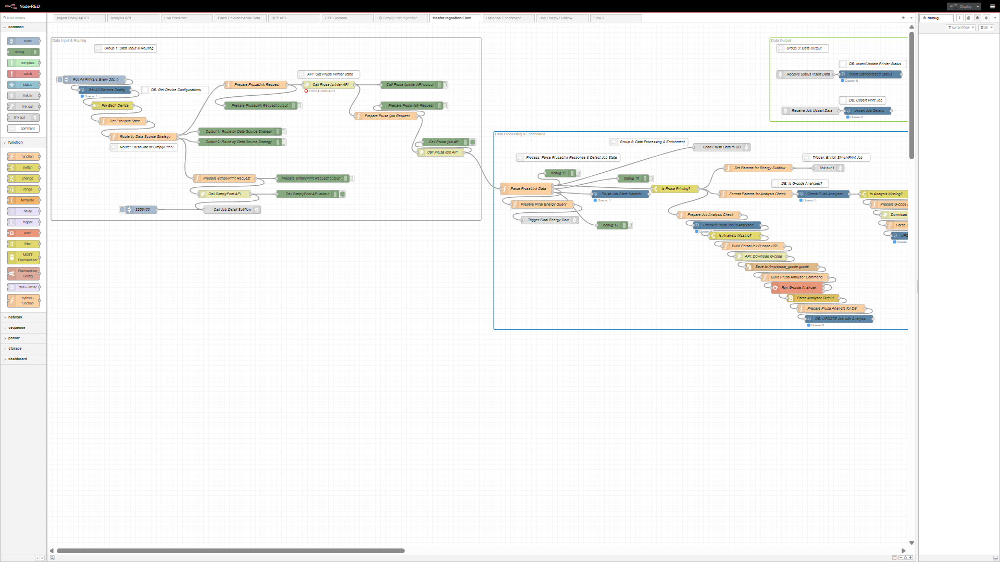

# ENMS - User Profiles & UI Guide

This document provides a guide to the different user profiles available in the ENMS frontend and explains the purpose of each view or dashboard accessible to them.

> For detailed information on the backend API that powers these views, please see the 📖 [**DPP API Documentation**](./DPP_API_Documentation.md).

## 1. Technical Profile

The Technical Profile is designed for engineers, developers, and system administrators who need deep access to the system's configuration and raw data streams.

### 1.1. Node-RED

*   **Description:** This tab provides direct access to the Node-RED flow editor. It is the primary tool for modifying data ingestion logic, creating new automation flows, and debugging the data pipeline. Users can view, edit, and deploy flows that control how data from MQTT and APIs is processed and stored.
*   **Screenshot:**
    

### 1.2. Industrial Hybrid Edge

*   **Description:** This is a Grafana dashboard designed for at-a-glance monitoring of the low-level sensor data from the custom ESP32 hardware. It provides real-time gauges and time-series charts for metrics like hot-end temperature (from the MAX6675 thermocouple) and power consumption from the smart plug. It's useful for diagnosing hardware-level issues.
*   **Screenshot:**
    

### 1.3. Sensor Explorer

*   **Description:** A detailed Grafana dashboard that allows for deep exploration of all sensor data collected from the ESP32 hubs. Users can view time-series graphs for accelerometer, gyroscope, and environmental sensor data, and correlate them to identify patterns or anomalies in machine behavior.
*   **Screenshot:**
    

## 2. Staff Profile

The Staff Profile is tailored for factory managers, operations staff, and team members who need to monitor fleet performance, compare machine efficiency, and analyze energy usage without needing to see the underlying system configuration.

### 2.1. Fleet Operations

*   **Description:** This is the primary overview dashboard in Grafana for the entire printer fleet. It provides high-level metrics on machine status (e.g., how many are printing, idle, or offline), recent job history, and overall energy consumption trends.
*   **Screenshot:**
    
#### **Downloading Job Reports (Digital Product Passport)**

A key feature of the "Recent Print Jobs" table on this dashboard is the ability to download a permanent record for any completed print.

*   **PDF Report:** In the "Report" column, a <i class="fas fa-file-pdf"></i> PDF icon will appear for any job that has a generated report.
*   **Purpose:** Clicking this icon allows you to download a detailed, single-page **Digital Product Passport** for that specific job.
*   **Content:** This PDF contains the final, authoritative data for the print, including:
    *   Total energy consumption and print duration.
    *   Material used and filament quantity.
    *   Key G-code metadata (object name, layer height, etc.).
    *   The final "energy plant" image, providing a visual summary of the job's energy footprint.

This report serves as a permanent certificate that can be kept with the physical printed object for traceability and quality assurance.

### 2.2. Performance Comparison

*   **Description:** A Grafana dashboard designed to compare the performance and energy efficiency of different machines. Users can view side-by-side comparisons of metrics like total print time, energy per job, and material usage, helping to identify the most efficient printers for specific tasks.
*   **Screenshot:**
    `

### 2.3. Interactive Analysis

*   **Description:** This view loads the custom analysis page (`analysis_page.html`). It provides a powerful, user-friendly interface to run detailed backend analyses. Users can select a specific printer, a time range, and various operational "drivers" (like nozzle temperature) to see how they correlate with energy consumption. The results are displayed in a series of charts and summary tables.
*   **Screenshot:**
    

## 3. DPP Profile

The DPP (Digital Product Passport) Profile is a specialized, visually-rich view designed to present a comprehensive "passport" for each machine. It is ideal for showcasing the system's capabilities or for users who need a beautiful and intuitive overview of the printers.

### 3.1. DPP View

*   **Description:** This tab loads the custom DPP page (`dpp_page.html`). It displays the printer fleet as an interactive carousel of "cards". Each card shows the live status of a printer, its current job progress, and key energy metrics. The cards can be flipped to reveal more detailed analysis and historical data. A key feature is the live 3D rendering of the G-code for the part currently being printed.
*   **Screenshot:**
    

#### **Downloading Job Reports (Digital Product Passport)**

A key feature of the "Recent Print Jobs" table on this dashboard is the ability to download a permanent record for any completed print.

*   **PDF Report:** In the "Report" column, a <i class="fas fa-file-pdf"></i> PDF icon will appear for any job that has a generated report.
*   **Purpose:** Clicking this icon allows you to download a detailed, single-page **Digital Product Passport** for that specific job.
*   **Content:** This PDF contains the final, authoritative data for the print, including:
    *   Total energy consumption and print duration.
    *   Material used and filament quantity.
    *   Key G-code metadata (object name, layer height, etc.).
    *   The final "energy plant" image, providing a visual summary of the job's energy footprint.

This report serves as a permanent certificate that can be kept with the physical printed object for traceability and quality assurance.

